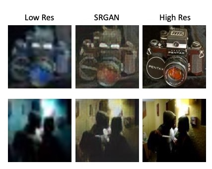
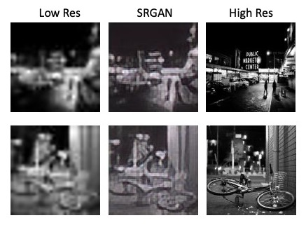

# Super Resolution
#### This work follows the paper on SRGAN by C. Ledig and the code is a continuation of the work done by Dr Sreeni https://www.youtube.com/c/DigitalSreeni/featured

Data have been taken by https://press.liacs.nl/mirflickr/mirdownload.html and about 5000 images (out of 25000) have split between train and test in order to optimize the the protocol
I have run the code on Google Colab using 10 and 20 epochs. Each epoch last around 15 minutes after utilizing the available free GPU service.
Here the results:

.

Fig1. Test images after 10 epochs training. 

.

Fig2. Test images after 20 epochs training

SRGAN will have to be run on an higher number of trained images and by increasing epochs if better results are needed.

### Medical images
SRGAN was also tested on medical images of a healthy brain model. After training the model on 5000 images, below a sample of the testing phase result.

